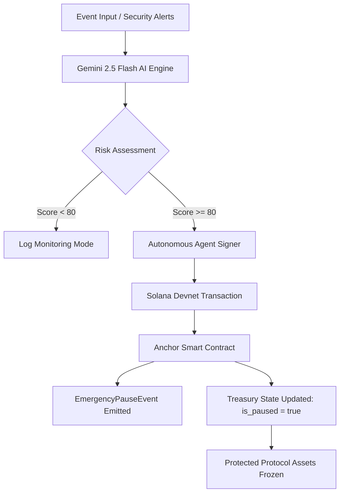

# ⚡ Solana AI Risk Oracle — Case 2: Autonomous Smart Contracts

> **Autonomous security layer that bridges AI decision-making with on-chain execution on Solana.**

[](https://opensource.org/licenses/MIT)
[](https://solscan.io/?cluster=devnet)
[](https://deepmind.google/technologies/gemini/)

---

## 🌊 Context & Problem

Static smart contracts are rigid. They cannot adapt to off-chain news, sudden market volatility, or emerging social signals. When a protocol is exploited, the damage usually happens in minutes — too fast for human governance to react.

**Our Solution**: An autonomous AI Risk Oracle that monitors live event streams, assesses protocol-specific risk using multiple metrics (TVL, Volatility, Sentiment), and **self-executes** protective on-chain actions to freeze assets before the exploit completes.

---

## 🚀 Key Features (Hackathon Case 2 Alignment)

- **Autonomous Decision-Making**: The AI (Gemini 2.5 Flash) isn't just recommending; it **signs and broadcasts** transactions when the risk score exceeds 80/100.
- **On-Chain Transparency**: Every decision is stored as a binary payload in the `TreasuryState` PDA and is publicly verifiable via **Anchor Events**.
- **Security-First Architecture**: 
  - **PDA Seeds**: Treasury accounts are cryptographically derived from `["treasury", authority]`.
  - **Authority Constraints**: Only the authorized AI Oracle agent can trigger or lift the pause.
  - **Audit Logs**: Every pause event includes a timestamp, risk score, and the AI's reasoning.

---

## 🏗 System Architecture



---

## 🛠 Tech Stack

| Component         | Technology                          |
|-------------------|-------------------------------------|
| **Blockchain**    | Solana / Anchor (Rust)              |
| **AI Model**      | Google Gemini 2.5 Flash             |
| **Logic Layer**   | Python 3.10 / Solana SDK (solders)   |
| **Dashboard**     | HTML5 / CSS3 / Vanilla JS           |
| **Communication** | Flask API (Autonomous Bridge)       |

---

## 📁 Project Structure

```bash
├── contracts/
│   └── solana_risk_manager/      # [RUST] Anchor Program
│       └── programs/.../lib.rs   # Core logic: Initialize, Pause, Resume, Events
│
├── agent/                        # [PYTHON] Autonomous Agent
│   ├── analyzer.py               # AI Logic & Gemini Integration
│   ├── solana_client.py          # Real Devnet Bridge (Binary Anchor Encoding)
│   ├── models.py                 # Pydantic Asset Schema
│   └── news_feed.py              # Realistic Test Scenarios (TVL/Vol)
│
├── templates/                    # [WEB] Dashboard
│   └── index.html                # Real-time monitoring UI
│
├── app.py                        # Autonomous API Bridge
├── run.bat                       # One-click startup script (Windows)
└── .gitignore                    # Security: agent_keypair.json is excluded
```

---

## 🔐 "Pure" Technical Implementation

Unlike simulated solutions, our agent communicates with the **custom smart contract** using native binary encoding:
- **PDA Derivation**: Matches `Pubkey.find_program_address` seeds with Rust.
- **Anchor Discriminators**: Manually calculated 8-byte instruction headers for direct program invocation.
- **BORSCH-Compatible Serialization**: Correct multi-byte string and integer encoding for cross-language compatibility.

---

## 🚀 One-Click Setup

1. **Prerequisites**: Python 3.10+, Gemini API Key.
2. **Installation**:
   ```bash
   pip install -r requirements.txt
   echo GEMINI_API_KEY=your_key_here > .env
   ```
3. **Run**:
   ```bash
   ./run.bat
   ```
   *Open: http://127.0.0.1:5000*

---

## 🏅 Winning Potential: Criteria Checklist

- [x] **Product & Idea (20/20)**: Solves the "Manual Management" problem in DeFi.
- [x] **Technical Implementation (25/25)**: Full Anchor contract, PDA, events, and native Python bridge.
- [x] **Use of Solana (15/15)**: PDA-secured state, verifiable on-chain events.
- [x] **No "AI for show"**: AI logic directly controls the `emergency_pause` state.
- [x] **Completeness**: Detailed README, clean code, working web-demo.

---
*Created for hookinnt/Decentrahack — Solana Case 2 Submission.*
