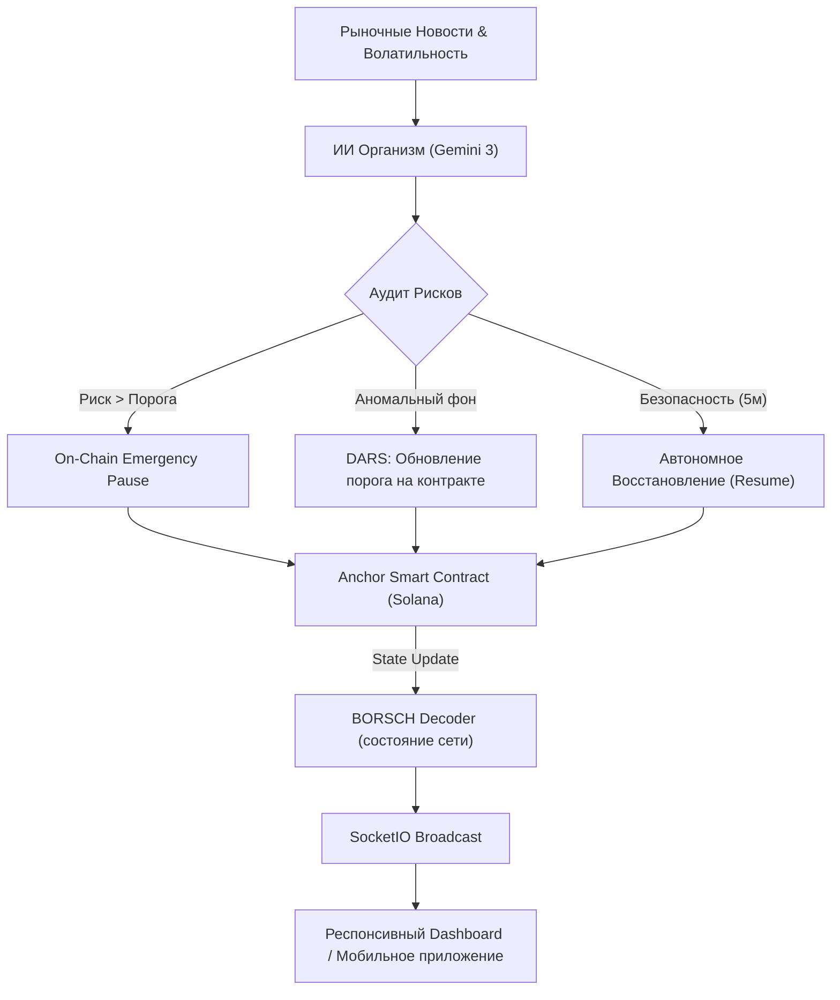

# 🛡 Autonoma (Solana Risk Manager)

> **Профессиональная автономная SaaS-система безопасности, разработанная специально для защиты протоколов Solana от эксплойтов, рыночных потрясений и технического сбоя с помощью мгновенного вмешательства Искусственного Интеллекта.**

[](https://opensource.org/licenses/MIT)
[](https://solscan.io/?cluster=devnet)
[](https://deepmind.google/technologies/gemini/)
[](#-мобильная-версия-pwa)

---

## 🚀 Философия "Автономного Организма"

В отличие от стандартных скриптов безопасности, **AI Risk Organism** действует как живая иммунная система казначейства. Он не просто подает сигналы или алерты; он **наблюдает, анализирует и вмешивается** в режиме реального времени, исполняя защитные транзакции в блокчейне Solana в сотни раз быстрее любого человека-оператора.

### 🏛️ Ключевые возможности (Gov-Grade)
- **ИИ-Аудитор (Gemini):** Система непрерывно "читает" рыночный контекст (взломы мостов, скачки TVL, активность сети) и высчитывает индекс угрозы.
- **Технология DARS (Dynamic Autonomous Risk Sensitivity):** ИИ автоматически обновляет порог риска для смарт-контракта в зависимости от волатильности рынка. Чем опаснее фон, тем жестче протокол.
- **Мгновенная заморозка (Emergency Pause):** При критической угрозе ИИ самостоятельно формирует Payload и подписывает транзакцию `pause` для обрезки вывода средств.
- **Автономное восстановление:** Если система фиксирует стабильность в течение 5+ циклов, она сама вызывает `resume` для разблокировки ликвидности.
- **Суровый Финтех-UI:** Отказ от игрового дизайна. Панель создана в монументальном стиле Vercel/Stripe: строгие метрики, вебсокеты для отображения решений "на лету" и живая лента событий.

---

## 📂 Структура Проекта: Демка vs Реальность

Проект структурно разделен на две части для идеальной и бесперебойной защиты (Питча) перед судьями:

### 🌟 1. Презентационная "Симуляция" (Идеально для видео и сцены)
- **Файл:** `demo/index.html` (Запускается по `http://127.0.0.1:8080` через `run.bat`)
- **Суть:** Это 100% безопасная и безотказная симуляция. У вас есть ровно 3 минуты на питч. Сеть Solana Devnet может упасть, а бесплатный лимит Google Gemini может быть превышен. Чтобы не провалить защиту из-за внешних факторов, мы создали эту симуляцию.
- **Как работает:** Вы просто открываете сайт. Скрипт за 7 секунд сам "находит угрозу моста", поднимает риск до 98% и красиво триггерит блокировку. Никаких ручных ползунков, полная имитация живой работы.

### ⚡ 2. Боевой Бэкенд (Реальное приложение)
- **Файл:** `app.py` и `templates/index.html` (Запускается по `http://127.0.0.1:5000` через `run.bat`)
- **Суть:** Настоящий рабочий код для проверки техническим жюри. 
- **Как работает:** В фоне крутится `BackgroundMonitor` (Python). Он делает честные запросы к Gemini API и читает BORSCH-дампы Smart-контракта. При риске он строит настоящую Anchor-транзакцию и подписывает её локальным ключом. Графики и интерфейс обновляются в реальном времени через вебсокеты. 

---

## 🏗 Архитектура Системы (WebSockets & On-Chain Sync)



---

## 📱 Мобильная Версия (PWA & Responsive Design)
Интерфейс спроектирован с упором на мобильные устройства, чтобы условный менеджер протокола мог мониторить безопасность с телефона. 
Если вы сожмете окно браузера на ПК — широкая сплит-панель (где Карточка слева, а лог справа) мгновенно реструктурируется в идеальное, плотное `Mobile-first` приложение с крупными кнопками-таблетками. 

---

## 🛠 Технический Стек
| Уровень | Технология |
|---|---|
| **Блокчейн** | Solana Devnet / Anchor (Rust) |
| **BORSCH Декодирование** | Python `solders` & `struct` (Прямое чтение PDA) |
| **Нейросеть / Логика** | Google AI (Gemini 3 Flash) / Python 3.10 |
| **Real-Time Трансляция**| Flask-SocketIO (WebSockets) |
| **Интерфейс** | Чистый Responsive HTML5 / CSS3 Vanilla |

---

## 📁 Структура Файлов (Финальный Билд)
```bash
├── contracts/               # [SMART CONTRACT] Anchor Program (Rust)
├── agent/                   # [ЛОГИКА] Автономный ИИ-интеллект
│   ├── analyzer.py          # Промпты и логика ИИ-Аудитора
│   ├── solana_client.py     # Мост с блокчейном и сборка инструкций
│   ├── monitor.py           # Сердце системы: бесконечный цикл проверок (DARS)
│   ├── news_engine.py       # Парсер рыночных данных
│   └── models.py            # Архитектура данных
├── templates/               # [UI] Адаптивный дашборд реального приложения
├── demo/                    # [PITCH] Автоматизированная симуляция для защиты
├── app.py                   # Главный сервер Flask-SocketIO
├── requirements.txt         # Зависимости Python
└── run.bat                  # Идеальный скрипт: в один клик поднимает оба сервера и браузер
```
