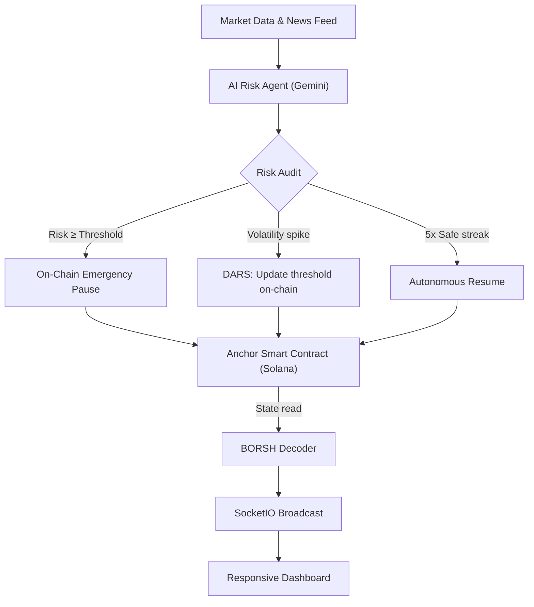

# 🛡 Autonoma — Solana Risk Manager

**Autonomous AI security system for Solana smart contracts.**  
Autonoma continuously monitors on-chain activity, market signals, and news feeds —  
and autonomously triggers an on-chain `emergency_pause` when a critical threat is detected.

[](https://opensource.org/licenses/MIT)
[](https://solscan.io/?cluster=devnet)
[](https://deepmind.google/technologies/gemini/)
[](#)

---

## Overview

Most DeFi security systems are **reactive** — they alert humans, who then manually sign a multisig transaction to pause the protocol. That process takes 15–40 minutes. Autonoma removes humans from the critical path entirely.

The system uses an AI agent (Google Gemini) to evaluate risk in real time and, when a threshold is breached, autonomously builds and submits an Anchor instruction to freeze the treasury — in seconds, not minutes.

---

## Core Features

| Feature | Description |
|---|---|
| **AI Risk Auditor** | Gemini-powered agent continuously scores risk across price, TVL, news, and chain activity |
| **DARS** | Dynamic Autonomous Risk Sensitivity — on-chain threshold auto-adjusts based on market volatility |
| **Emergency Pause** | Agent autonomously signs and submits `emergency_pause` to the Anchor program when risk ≥ threshold |
| **Auto-Recovery** | After 5 consecutive safe cycles, the agent calls `resume()` to unfreeze the treasury |
| **Deterministic Fallback** | If the AI API is unavailable, a keyword-based fallback engine maintains protection |
| **Real-Time Dashboard** | WebSocket-powered UI with live risk score, event log, and on-chain state |

---

## System Architecture



---

## Project Structure

```
├── contracts/               # Anchor Program (Rust) — Solana smart contract
│   └── solana_risk_manager/ # initialize / emergency_pause / resume / update_threshold
├── agent/
│   ├── analyzer.py          # AI auditor: prompt logic + fallback engine
│   ├── monitor.py           # Background monitor loop (DARS, auto-recover)
│   ├── solana_client.py     # On-chain read/write via solders + anchorpy
│   ├── news_engine.py       # Market data & news feed parser
│   └── models.py            # Pydantic data models
├── templates/index.html     # Live dashboard (WebSocket-connected)
├── demo/index.html          # Standalone simulation (no backend required)
├── app.py                   # Flask-SocketIO server
├── requirements.txt
└── run.bat                  # One-click launcher (both servers + browser)
```

---

## Getting Started

### Prerequisites

- Python 3.10+
- A `GEMINI_API_KEY` from [aistudio.google.com](https://aistudio.google.com)
- (Optional, for contract deployment) Solana CLI + Anchor

### Setup

```bash
# 1. Create a virtual environment
python -m venv venv

# 2. Activate it
venv\Scripts\activate        # Windows
# source venv/bin/activate   # Linux / macOS

# 3. Install dependencies
pip install -r requirements.txt

# 4. Configure environment
copy .env.example .env
# Edit .env and add your GEMINI_API_KEY
```

### Run

```bash
# Option A — one-click (Windows)
run.bat

# Option B — manual
python app.py              # Live engine on http://127.0.0.1:5000
python -m http.server 8080 -d demo   # Standalone demo on http://127.0.0.1:8080
```

---

## Modules

### `demo/index.html` — Standalone Simulation
An isolated, offline-capable frontend that demonstrates the full protection flow without requiring a running backend or network connection.  
Open `http://127.0.0.1:8080` and click **"ЗАПУСТИТЬ ЭМУЛЯЦИЮ"** to start the scenario: network scan → anomaly detected → emergency lockdown at 98% risk.

### `templates/index.html` + `app.py` — Live Engine
Full-stack application. The `BackgroundMonitor` runs as a daemon thread, polls the Solana RPC for on-chain state, queries the AI agent, and pushes updates to the frontend via WebSockets. On critical risk, it builds and signs an actual Anchor transaction locally.

---

## Tech Stack

| Layer | Technology |
|---|---|
| **Blockchain** | Solana Devnet / Anchor (Rust) |
| **BORSH Decoding** | Python `solders` + `struct` (direct PDA reads) |
| **AI Engine** | Google Gemini Flash via `google-generativeai` |
| **Real-Time** | Flask-SocketIO (WebSockets via eventlet) |
| **Frontend** | Vanilla HTML5 / CSS3 — no frameworks |

---

## Smart Contract — Instruction Summary

| Instruction | Description |
|---|---|
| `initialize` | Creates the treasury PDA and sets initial risk threshold |
| `emergency_pause` | Locks the treasury; logs reason and risk score on-chain |
| `resume` | Unlocks the treasury after manual or autonomous recovery |
| `update_threshold` | Updates the DARS risk threshold on-chain |

---

## Environment Variables

```env
GEMINI_API_KEY=your_key_here
SOLANA_RPC_URL=https://api.devnet.solana.com
PROGRAM_ID=your_deployed_program_id
```

See `.env.example` for the full reference.

---

## License

MIT — see [LICENSE](LICENSE).
