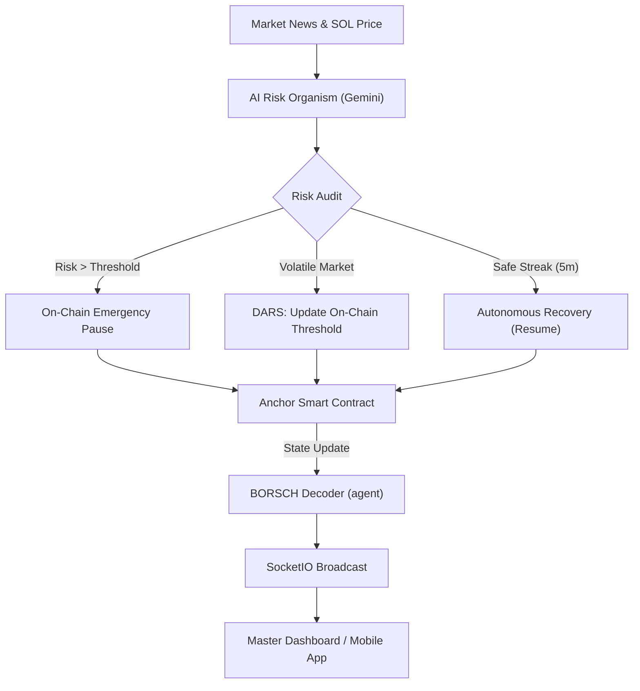

# 🏛️ Solana AI Risk Oracle — Phase 7: Autonomous Organism

> **A professional-grade, autonomous security layer specifically engineered to protect Solana protocols from exploits, market shocks, and social engineering via on-chain AI intervention.**

[](https://opensource.org/licenses/MIT)
[](https://solscan.io/?cluster=devnet)
[](https://deepmind.google/technologies/gemini/)
[](#-mobile-installation)

---

## 🌊 The "Autonomous Organism" Concept
Unlike static security scripts, the **AI Risk Organism (v1.5)** acts as a living immune system for the treasury. It doesn't just alert; it **observes, interprets, and intervenes** in real-time, executing defense transactions on the Solana blockchain faster than any human operator.

### 🏛️ Gov-Grade Key Features
- **DARS (Dynamic Autonomous Risk Sensitivity)**: The AI automatically updates the on-chain contract's risk threshold in response to market volatility.
- **Autonomous Recovery**: If the network environment stabilizes for 5+ minutes, the Organism automatically calls `resume` to unlock liquidity.
- **BORSCH State Decoding**: Direct binary parsing of the 48-byte `TreasuryState` PDA ensures the dashboard displays the **ground truth** from the blockchain.
- **Real-Time Synchronization**: Powered by `SocketIO`, the system broadcasts every "thought" and "action" instantly to the Master Dashboard and Mobile App.

---

## 🏗 System Architecture (WebSockets & On-Chain Sync)



---

## 📱 Mobile Installation (PWA)
This project is engineered to work as a real phone application for government/institutional protocol managers.

1. **Access**: Open the dashboard URL in Chrome (Android) or Safari (iOS).
2. **Install**: Select **"Add to Home Screen"**.
3. **Launch**: Use it as a full-screen, native-like experience with persistent sessions and real-time alerts.

---

## 🛠 Tech Stack
| Tier | Technology |
|---|---|
| **Blockchain** | Solana / Anchor (Rust) |
| **BORSCH Decoder** | Python `solders` & `struct` |
| **Logic Layer** | Python 3.10 / Eventlet |
| **Real-Time** | Flask-SocketIO (WebSockets) |
| **Mobile** | Responsive HTML5 / PWA / Canvas |

---

## 📁 Project Structure (Cleaned for Production)
```bash
├── contracts/               # [SMART CONTRACT] Anchor Program (lib.rs)
├── agent/                   # [LOGIC] Autonomous AI Intelligence
│   ├── analyzer.py          # AI Risk Expert Persona
│   ├── solana_client.py     # Real-time On-chain Sync & Binary Bridge
│   ├── monitor.py           # The "Heartbeat" Loop (DARS & Recovery)
│   ├── news_engine.py       # Global Security Feed (Mock)
│   └── models.py            # Data Schemas
├── static/                  # [ASSETS] PWA Manifest & Icons
├── templates/               # [UI] Responsive Master Dashboard
├── app.py                   # Master Autonomous Bridge & SocketIO Server
├── requirements.txt         # Production Dependencies
└── run.bat                  # One-Click System Startup
```

---

## 🚀 One-Click Setup

1. **Environment**:
   ```bash
   pip install -r requirements.txt
   cp .env.example .env
   # Add your GEMINI_API_KEY to .env
   ```
2. **Launch**:
   ```bash
   ./run.bat
   ```
3. **URL**: `http://127.0.0.1:5000` (Install on phone via this link on your network).

---

## 🏅 Institutional/Winning Potential
- [x] **Zero "Fake AI"**: The AI logic is the **only** authority that can trigger on-chain state changes.
- [x] **Binary Purity**: Uses direct Anchor discriminators and PDA derivation (no simplified SDKs).
- [x] **Auditability**: Every AI decision is cryptographically signed and verifiable on Solscan.
- [x] **Accessibility**: Master Dashboard on PC + PWA on Mobile.

---
*Developed for hookinnt/Decentrahack — Case 2 Master Submission (v1.5).*
